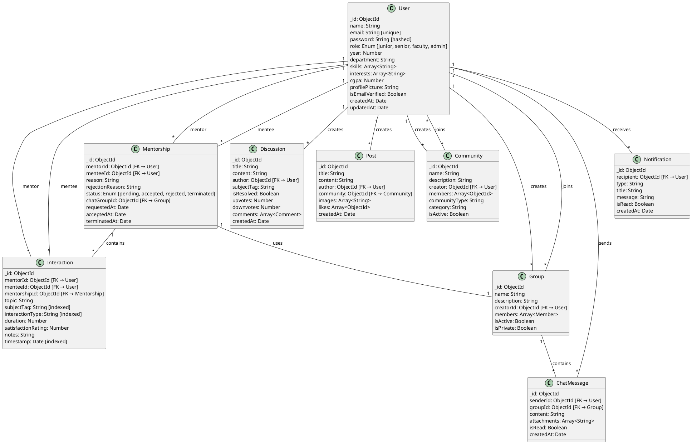
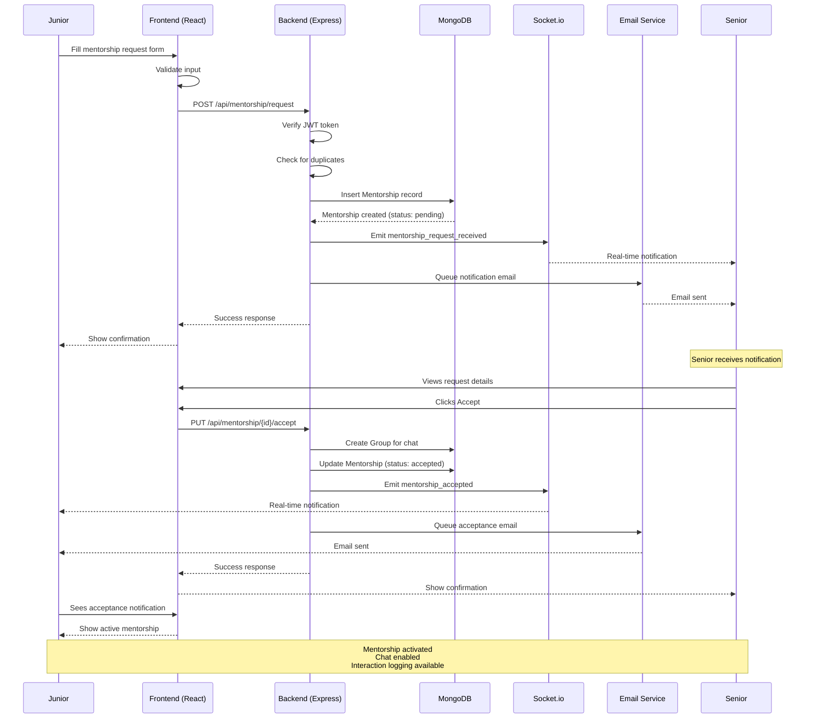
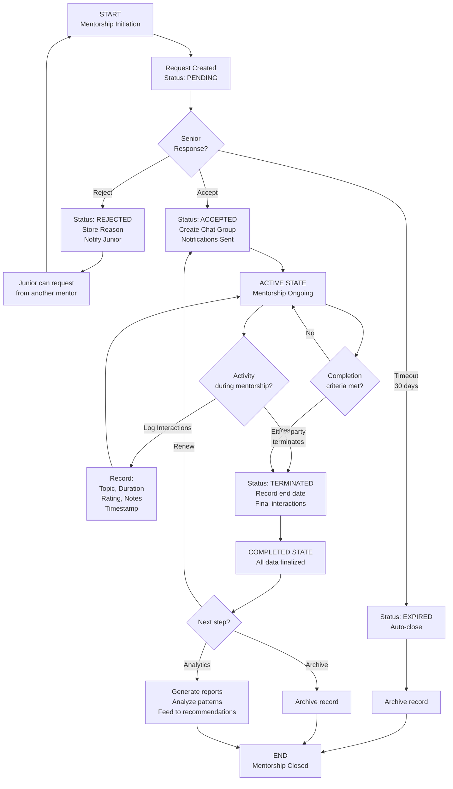
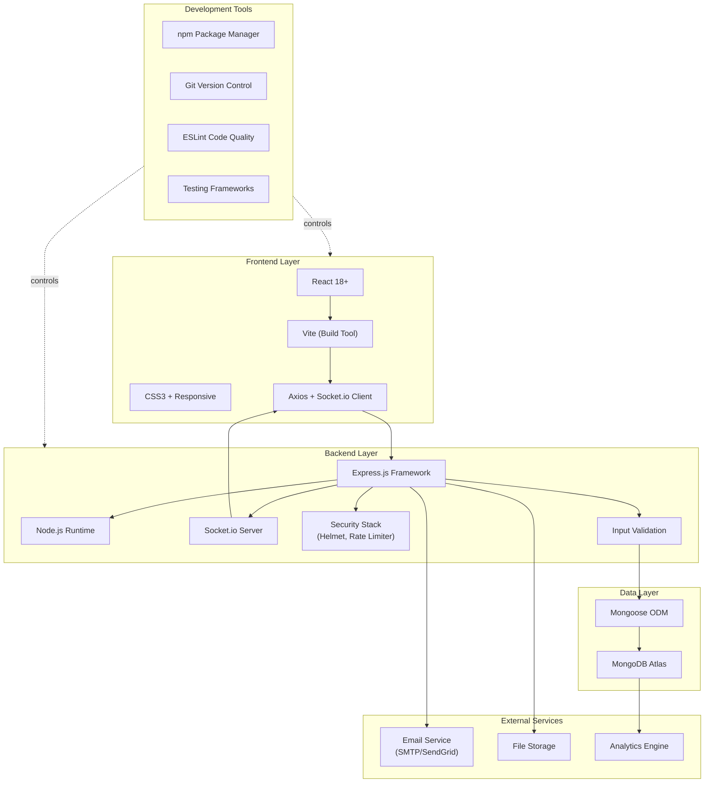
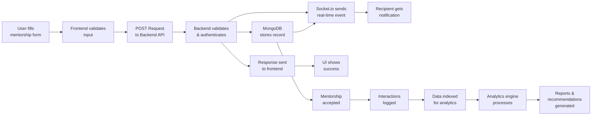

# MentorLink - Diagram Generation Formats

This file contains diagram descriptions in multiple formats for easy integration with image generation tools (Lucidchart, Draw.io, Visio, Mermaid, PlantUML, etc.).

---

## 1. SYSTEM ARCHITECTURE DIAGRAM

### Format: Text Description for Lucidchart/Draw.io

**Canvas Size**: 1400 x 900

**Layers (Top to Bottom):**

1. **Client Layer (Top - 50px height)**
   - Component: "Frontend Application (React + Vite)"
   - Position: Center, width 1000px
   - Connections: DOWN to API Gateway

2. **API Layer (150px height)**
   - Component: "Express.js Server (Port 3000)"
   - Center container
   - Inside containers:
     - "Auth Service" (left)
     - "API Routes" (center)
     - "Real-time (Socket.io)" (right)
   - Connections: DOWN to Services Layer, RIGHT to Email

3. **Services Layer (300px height)**
   - Multiple service boxes in 2 rows:
     - Row 1: Mentorship, Interactions, Discussions, Communities
     - Row 2: Chat, Notifications, Recommendations, Analytics
   - Each service: 200px wide, 80px tall
   - Connections: DOWN to Database

4. **Database Layer (bottom)**
   - Component: "MongoDB Atlas"
   - Collections listed inside
   - Backup and Replication indicators

**Connections (Arrows)**
- Solid lines: Data flow
- Dashed lines: Real-time events
- Label arrows: "REST API", "WebSocket", "MongoDB Protocol"

---

## 2. USE CASE DIAGRAM

### Format: Mermaid Diagram Syntax

```mermaid
graph TB
    Actor1[👤 Junior User]
    Actor2[👤 Senior User]
    Actor3[👥 Faculty User]
    Actor4[⚙️ Admin User]
    
    UC1[Register & Login]
    UC2[Update Profile]
    UC3[Request Mentorship]
    UC4[Browse Mentors]
    UC5[Accept/Reject Request]
    UC6[Log Interactions]
    UC7[View Interaction History]
    UC8[Create Discussion]
    UC9[Vote/Comment]
    UC10[Create Community]
    UC11[Send Messages]
    UC12[View Analytics]
    UC13[Generate Reports]
    
    Actor1 -->|uses| UC1
    Actor1 -->|uses| UC2
    Actor1 -->|initiates| UC3
    Actor1 -->|performs| UC4
    Actor1 -->|logs| UC6
    Actor1 -->|performs| UC8
    Actor1 -->|performs| UC9
    Actor1 -->|performs| UC11
    
    Actor2 -->|uses| UC1
    Actor2 -->|uses| UC2
    Actor2 -->|responds to| UC5
    Actor2 -->|logs| UC6
    Actor2 -->|performs| UC8
    Actor2 -->|performs| UC10
    Actor2 -->|performs| UC11
    
    Actor3 -->|uses| UC1
    Actor3 -->|responds to| UC5
    Actor3 -->|logs| UC6
    Actor3 -->|views| UC12
    Actor3 -->|generates| UC13
    
    Actor4 -->|views| UC12
    Actor4 -->|generates| UC13
```



### Format: Use Case Descriptions for Visio

**Use Case Name**: Request Mentorship
- **Actors**: Junior, Senior
- **Preconditions**: Junior logged in, Senior profile exists
- **Main Flow**:
  1. Junior selects "Request Mentorship"
  2. System shows list of available mentors
  3. Junior selects mentor and enters reason
  4. System validates request (no duplicates)
  5. System creates Mentorship record (status: pending)
  6. System sends notification to mentor
  7. System displays confirmation to junior
- **Alternative**: Duplicate request exists → Show error message
- **Postcondition**: Mentorship request created

**Use Case Name**: Accept Mentorship Request
- **Actors**: Senior, System
- **Preconditions**: Mentorship request exists (status: pending)
- **Main Flow**:
  1. Senior receives notification
  2. Senior views request details
  3. Senior clicks "Accept"
  4. System creates Group for chat
  5. System adds both users to Group
  6. System updates Mentorship status to "accepted"
  7. System sends notification to junior
  8. System enables interaction logging
- **Postcondition**: Mentorship activated, chat available

---

## 3. CLASS DIAGRAM (ERD)

### Format: PlantUML Syntax



---

## 4. SEQUENCE DIAGRAM: MENTORSHIP REQUEST FLOW

### Format: Mermaid Sequence Diagram



---

## 5. FLOWCHART: MENTORSHIP LIFECYCLE

### Format: Mermaid Flowchart



---

## 6. SYSTEM BLOCK DIAGRAM

### Format: ASCII Art for Quick Reference

```
┌─────────────────────────────────────────────────────┐
│             CLIENT LAYER                             │
│         Frontend (React + Vite)                      │
└────────────────────┬────────────────────────────────┘
                     │ REST API + WebSocket
┌────────────────────┴────────────────────────────────┐
│         APPLICATION LAYER (Express.js)               │
├──────────────────────────────────────────────────────┤
│ Cross-cutting: Auth | Security | Validation | Error  │
├──────────────────────────────────────────────────────┤
│  ┌─────────────┐  ┌──────────────┐ ┌──────────────┐ │
│  │ AUTH Module │  │ USER Module  │ │ MENTORSHIP   │ │
│  │             │  │              │ │ Module       │ │
│  └─────────────┘  └──────────────┘ └──────────────┘ │
│                                                      │
│  ┌─────────────┐  ┌──────────────┐ ┌──────────────┐ │
│  │ INTERACTION │  │ DISCUSSION   │ │ COMMUNITY    │ │
│  │ LOGGING ★   │  │ Forum        │ │ Management   │ │
│  └─────────────┘  └──────────────┘ └──────────────┘ │
│                                                      │
│  ┌─────────────┐  ┌──────────────┐ ┌──────────────┐ │
│  │ CHAT &      │  │ NOTIFICATION │ │ RECOMMENDATION
│  │ MESSAGING   │  │ SYSTEM       │ │ ENGINE      │ │
│  └─────────────┘  └──────────────┘ └──────────────┘ │
│                                                      │
│  ┌─────────────┐  ┌──────────────┐                  │
│  │ ANALYTICS & │  │ FILE UPLOAD  │                  │
│  │ REPORTING   │  │ STORAGE      │                  │
│  └─────────────┘  └──────────────┘                  │
└────────────────────┬────────────────────────────────┘
                     │ Mongoose ODM
┌────────────────────┴────────────────────────────────┐
│          DATA ACCESS LAYER                          │
│        (ORM/Schema Validation)                      │
└────────────────────┬────────────────────────────────┘
                     │ MongoDB Protocol
┌────────────────────┴────────────────────────────────┐
│         DATABASE LAYER                              │
│      MongoDB Atlas (Cloud)                          │
│                                                      │
│  Users | Mentorships | Interactions | Discussions  │
│  Posts | Communities | Groups | ChatMessages        │
│  Notifications | ... (optimized indexes)            │
└────────────────────┬────────────────────────────────┘
                     │
    ┌────────────────┼────────────────┐
    │                │                │
┌───▼───┐      ┌─────▼─────┐     ┌───▼───┐
│ Email │      │   File    │     │ Socket│
│Service│      │  Storage  │     │  .io  │
└───────┘      └───────────┘     └───────┘
```

### Format: Structured Text for Visio

```
LAYER: Presentation
  COMPONENT: Frontend Application (React + Vite)
    LOCATION: Top-center
    WIDTH: 1200px
    HEIGHT: 100px
    CONTAINS:
      - Mentorship Dashboard
      - Profile Management
      - Interaction UI
      - Discussion Forum
      - Chat Interface
      - Analytics Dashboard

LAYER: Application
  CONTAINER: Express.js Server
    LOCATION: Center
    WIDTH: 1200px
    HEIGHT: 400px
    
    CONTAINER: Cross-cutting Concerns
      - Authentication (JWT)
      - Security (Helmet, Rate Limiting)
      - Validation (Input sanitization)
      - Error Handling
    
    MODULE: Auth Module
      FUNCTIONS:
        - Register user
        - Login
        - Password reset
        - Email verification
      DEPENDS_ON: Database, Email Service
    
    MODULE: User Management
      FUNCTIONS:
        - Create/update profile
        - Skill management
        - Mentor discovery
      DEPENDS_ON: Database, User Model
    
    MODULE: Mentorship
      FUNCTIONS:
        - Create request
        - Accept/reject
        - Terminate
      DEPENDS_ON: Database, Notifications, Groups
    
    MODULE: Interaction Logging ★
      FUNCTIONS:
        - Log interactions
        - Calculate statistics
        - Feed to analytics
      DEPENDS_ON: Database, Mentorship
    
    MODULE: Discussion Forum
      FUNCTIONS:
        - Create posts
        - Comment & vote
        - Search by subject
      DEPENDS_ON: Database
    
    MODULE: Community Management
      FUNCTIONS:
        - Create communities
        - Manage members
        - Moderation
      DEPENDS_ON: Database, Users
    
    MODULE: Chat & Messaging
      FUNCTIONS:
        - Real-time messaging
        - Group chats
        - File attachments
      DEPENDS_ON: Socket.io, Database
    
    MODULE: Notification System
      FUNCTIONS:
        - Real-time notifications
        - Email notifications
      DEPENDS_ON: Socket.io, Email Service
    
    MODULE: Recommendation Engine
      FUNCTIONS:
        - Suggest mentors
        - Suggest groups
        - Suggest topics
      DEPENDS_ON: Analytics, Database
    
    MODULE: Analytics & Reporting
      FUNCTIONS:
        - Generate reports
        - Trend analysis
        - Clustering
      DEPENDS_ON: Database queries
    
    MODULE: File Management
      FUNCTIONS:
        - Upload files
        - Validate type/size
        - Generate URLs
      DEPENDS_ON: File Storage

LAYER: Data Access
  COMPONENT: Mongoose ODM
    FUNCTIONS:
      - Schema validation
      - Query building
      - Relationship management
      - Index management

LAYER: Database
  COMPONENT: MongoDB Atlas
    COLLECTIONS:
      - Users (indexes: email, role, skills)
      - Mentorships (indexes: mentor, mentee, status)
      - Interactions (indexes: subject, type, timestamp) ★
      - Discussions (indexes: subject, author)
      - Posts (indexes: author, community)
      - Communities (indexes: creator, type)
      - Groups (indexes: creator, members)
      - ChatMessages (indexes: group, sender)
      - Notifications (indexes: recipient, type)

EXTERNAL_SERVICES:
  - Email Service (SMTP)
  - Socket.io Server
  - File Storage (Local/S3)
```

---

## 7. TECHNOLOGY STACK DIAGRAM

### Format: Mermaid Graph



---

## 8. DATA FLOW DIAGRAM

### Format: Mermaid Flowchart (Mentorship Request to Analytics)



---

## 9. ENTITY RELATIONSHIP DIAGRAM (ERD)

### Format: Text-based ERD for Lucidchart

```
ENTITY: User
ATTRIBUTES: _id, name, email (PK), password, role, year, department, skills, interests, cgpa, profilePicture, createdAt, updatedAt
PRIMARY_KEY: email
INDEXES: email (unique), role, department, skills (array), year

ENTITY: Mentorship
ATTRIBUTES: _id, mentorId (FK), menteeId (FK), reason, rejectionReason, status, chatGroupId (FK), requestedAt, acceptedAt, terminatedAt, createdAt, updatedAt
PRIMARY_KEY: _id
FOREIGN_KEYS: mentorId→User, menteeId→User, chatGroupId→Group
INDEXES: mentorId, menteeId, status, compound(mentorId, menteeId, status)
RELATIONSHIPS:
  - Mentorship.mentorId (N) ←→ (1) User._id
  - Mentorship.menteeId (N) ←→ (1) User._id
  - Mentorship._id (1) ←→ (N) Interaction.mentorshipId
  - Mentorship.chatGroupId (1) ←→ (1) Group._id

ENTITY: Interaction ★ CRITICAL FOR ANALYTICS ★
ATTRIBUTES: _id, mentorId (FK), menteeId (FK), mentorshipId (FK), topic, subjectTag, interactionType, duration, satisfactionRating, notes, timestamp, createdAt, updatedAt
PRIMARY_KEY: _id
FOREIGN_KEYS: mentorId→User, menteeId→User, mentorshipId→Mentorship
INDEXES: mentorId, menteeId, mentorshipId, subjectTag, interactionType, timestamp, compound(subjectTag, interactionType, timestamp)
RELATIONSHIPS:
  - Interaction.mentorId (N) ←→ (1) User._id
  - Interaction.menteeId (N) ←→ (1) User._id
  - Interaction.mentorshipId (N) ←→ (1) Mentorship._id

ENTITY: Discussion
ATTRIBUTES: _id, title, content, author (FK), subjectTag, isResolved, upvotes, downvotes, views, comments (array), createdAt, updatedAt
PRIMARY_KEY: _id
FOREIGN_KEYS: author→User
INDEXES: author, subjectTag, isResolved, createdAt
RELATIONSHIPS:
  - Discussion.author (N) ←→ (1) User._id

ENTITY: Post
ATTRIBUTES: _id, title, content, author (FK), community (FK), images (array), likes (array), shares, createdAt, updatedAt
PRIMARY_KEY: _id
FOREIGN_KEYS: author→User, community→Community
INDEXES: author, community, createdAt
RELATIONSHIPS:
  - Post.author (N) ←→ (1) User._id
  - Post.community (N) ←→ (1) Community._id

ENTITY: Community
ATTRIBUTES: _id, name, description, creator (FK), members (array), communityType, category, isActive, createdAt, updatedAt
PRIMARY_KEY: _id
FOREIGN_KEYS: creator→User
INDEXES: creator, type, category, isActive
RELATIONSHIPS:
  - Community.creator (N) ←→ (1) User._id
  - Community.members (N,M) ←→ (*,M) User._id

ENTITY: Group
ATTRIBUTES: _id, name, description, creatorId (FK), members (array of {userId, joinedAt, role}), isActive, isPrivate, createdAt, updatedAt
PRIMARY_KEY: _id
FOREIGN_KEYS: creatorId→User
INDEXES: creatorId, isActive
RELATIONSHIPS:
  - Group.creatorId (N) ←→ (1) User._id
  - Group.members (*) ←→ (*) User._id
  - Group._id (1) ←→ (N) ChatMessage.groupId

ENTITY: ChatMessage
ATTRIBUTES: _id, senderId (FK), recipientId (FK), groupId (FK), content, attachments (array), isRead, createdAt, updatedAt
PRIMARY_KEY: _id
FOREIGN_KEYS: senderId→User, recipientId→User, groupId→Group
INDEXES: senderId, groupId, createdAt
RELATIONSHIPS:
  - ChatMessage.senderId (N) ←→ (1) User._id
  - ChatMessage.recipientId (N) ←→ (1) User._id
  - ChatMessage.groupId (N) ←→ (1) Group._id

ENTITY: Notification
ATTRIBUTES: _id, recipient (FK), sender (FK), type, title, message, relatedEntity (ObjectId), isRead, createdAt
PRIMARY_KEY: _id
FOREIGN_KEYS: recipient→User, sender→User
INDEXES: recipient, type, isRead, createdAt
RELATIONSHIPS:
  - Notification.recipient (N) ←→ (1) User._id
  - Notification.sender (N) ←→ (1) User._id (optional)
```

---

## 10. API ENDPOINT REFERENCE

### Format: Structured Reference for Documentation

```
BASE_URL: http://localhost:3000/api

=== AUTHENTICATION ENDPOINTS ===
POST /auth/register
  - Input: { name, email, password, role, year, department }
  - Output: { success, message, user, token }

POST /auth/login
  - Input: { email, password }
  - Output: { success, user, token }

POST /auth/forgot-password
  - Input: { email }
  - Output: { success, message }

GET /auth/me
  - Headers: Authorization: Bearer {token}
  - Output: { success, user }

=== USER ENDPOINTS ===
GET /users/profile/:id
  - Output: { success, user }

PUT /users/profile
  - Headers: Authorization: Bearer {token}
  - Input: { skills, interests, cgpa, bio, profilePicture }
  - Output: { success, user }

GET /users/mentors?year=2&department=CSE&skills=Python
  - Query params: filters
  - Output: { success, mentors }

GET /users/mentees
  - Headers: Authorization: Bearer {token}
  - Output: { success, mentees }

=== MENTORSHIP ENDPOINTS ===
POST /mentorship/request
  - Headers: Authorization: Bearer {token}
  - Input: { mentorId, reason }
  - Output: { success, mentorshipId }

GET /mentorship/my-requests
  - Headers: Authorization: Bearer {token}
  - Output: { success, requests }

GET /mentorship/active
  - Headers: Authorization: Bearer {token}
  - Output: { success, mentorships }

PUT /mentorship/:id/accept
  - Headers: Authorization: Bearer {token}
  - Output: { success }

PUT /mentorship/:id/reject
  - Headers: Authorization: Bearer {token}
  - Input: { rejectionReason }
  - Output: { success }

PUT /mentorship/:id/terminate
  - Headers: Authorization: Bearer {token}
  - Output: { success }

=== INTERACTION ENDPOINTS ===
POST /interactions/log
  - Headers: Authorization: Bearer {token}
  - Input: { mentorshipId, topic, subjectTag, interactionType, duration, satisfactionRating, notes }
  - Output: { success, interactionId }

GET /interactions/my
  - Headers: Authorization: Bearer {token}
  - Output: { success, interactions }

GET /interactions/stats?subjectTag=Algorithms&month=202605
  - Query params: filters for analytics
  - Output: { success, statistics }

=== DISCUSSION ENDPOINTS ===
POST /discussions/create
  - Headers: Authorization: Bearer {token}
  - Input: { title, content, subjectTag }
  - Output: { success, discussionId }

GET /discussions?subjectTag=Data%20Structures&sort=votes
  - Output: { success, discussions }

POST /discussions/:id/comment
  - Headers: Authorization: Bearer {token}
  - Input: { content }
  - Output: { success }

POST /discussions/:id/vote
  - Headers: Authorization: Bearer {token}
  - Input: { type: 'upvote' | 'downvote' }
  - Output: { success }

=== RECOMMENDATIONS ENDPOINTS ===
GET /recommendations/mentors
  - Headers: Authorization: Bearer {token}
  - Output: { success, suggestedMentors }

GET /recommendations/peer-groups
  - Headers: Authorization: Bearer {token}
  - Output: { success, suggestedGroups }

GET /recommendations/topics
  - Headers: Authorization: Bearer {token}
  - Output: { success, suggestedTopics }

=== ANALYTICS ENDPOINTS ===
GET /analytics/mentor-performance?mentorId=...&timeRange=...
  - Headers: Authorization: Bearer {token} + Role: faculty/admin
  - Output: { success, metrics }

GET /analytics/subject-engagement?month=202605
  - Output: { success, statistics }

GET /analytics/trends
  - Output: { success, trends }
```

---

## How to Use These Descriptions

### For Lucidchart:
1. Copy the text descriptions from sections 1, 2, 6, 7, or 8
2. Use these as detailed specifications
3. Create shapes and connections based on the layout and relationships described
4. Use the positioning guidelines for proper diagram arrangement

### For Draw.io:
1. Import Mermaid diagrams directly (Draw.io has Mermaid support)
2. Or copy-paste the ASCII art diagrams
3. Manually recreate complex diagrams using the text descriptions

### For Visio:
1. Use the structured text format from sections 1, 2, 3, 4, 6, and 7
2. Create shapes for each component
3. Use connectors for relationships
4. Apply the positioning guidelines

### For Mermaid/PlantUML Tools:
1. Copy the Mermaid or PlantUML syntax directly
2. Paste into respective online editors or CLI tools
3. Export as PNG/SVG/PDF

### For Custom Tools or AI Image Generators:
1. Use the detailed text descriptions from DIAGRAM_DESCRIPTIONS.md
2. Provide a diagram description to your image generation tool
3. Specify style preferences (flat, 3D, professional, cartoon, etc.)
4. Request specific colors or branding

---

## Recommended Tools by Diagram Type

| Diagram Type | Recommended Tools |
|---|---|
| **System Architecture** | Lucidchart, Draw.io, Miro, OmniGraffle |
| **Use Case** | Lucidchart, Visio, ArchiMate tools, MagicDraw |
| **Class Diagram** | PlantUML, Mermaid, Visual Paradigm, Enterprise Architect |
| **Sequence** | Mermaid, PlantUML, Lucidchart, Websequencediagrams |
| **Flowchart** | Mermaid, Draw.io, Lucidchart, Visio |
| **Block Diagram** | Lucidchart, Visio, Miro |
| **Technology Stack** | Mermaid, Draw.io, Lucidchart |
| **ERD** | MySQL Workbench, Lucidchart, Visio, DB Designer |

---

## Color Scheme Suggestions

**Professional Blue Theme:**
- Primary: #0066CC (Blue)
- Secondary: #00AA44 (Green)
- Accent: #FF6600 (Orange)
- Background: #F5F5F5 (Light Gray)
- Text: #333333 (Dark Gray)

**Modern Dark Theme:**
- Primary: #1E90FF (Dodger Blue)
- Secondary: #00C878 (Green)
- Accent: #FFD700 (Gold)
- Background: #1A1A1A (Dark)
- Text: #FFFFFF (White)

---

## File Organization for Generated Diagrams

```
Generated_Diagrams/
├── Architecture/
│   ├── system-architecture.png
│   ├── block-diagram.png
│   └── deployment-diagram.png
├── Analysis/
│   ├── use-case-diagram.png
│   ├── class-diagram.png
│   └── erd.png
├── Design/
│   ├── sequence-mentorship-flow.png
│   ├── mentorship-lifecycle.png
│   └── data-flow-diagram.png
└── Technology/
    ├── tech-stack.png
    └── api-structure.png
```

---

