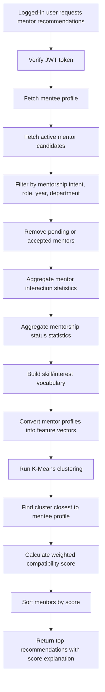
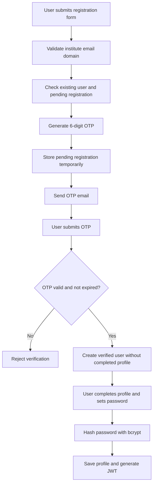
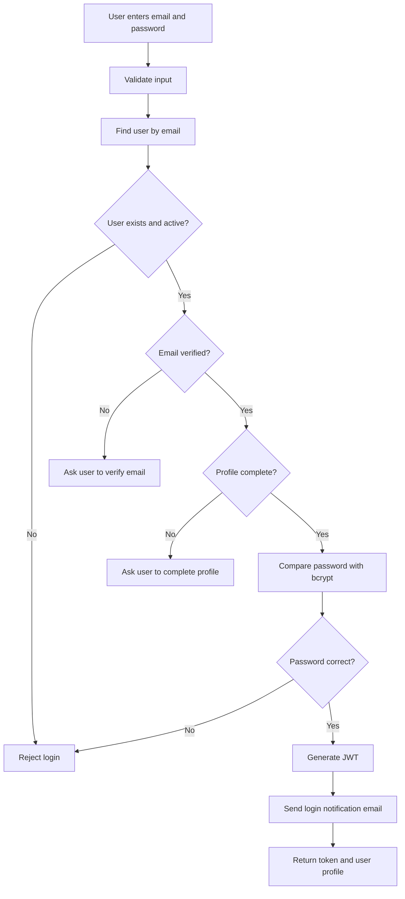
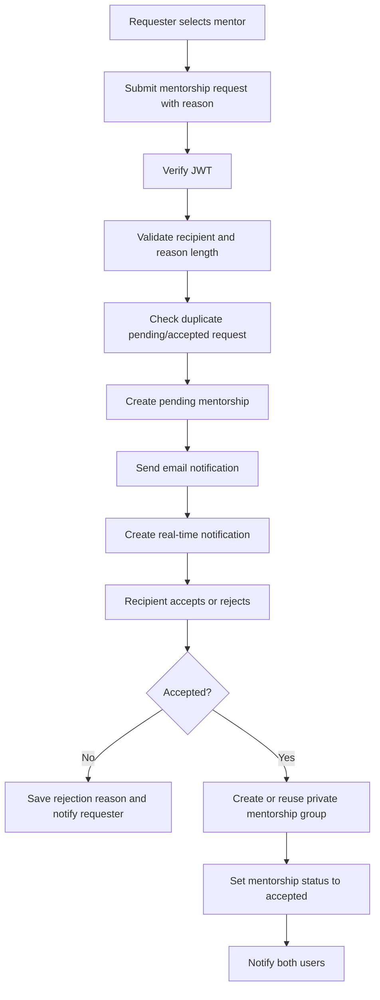
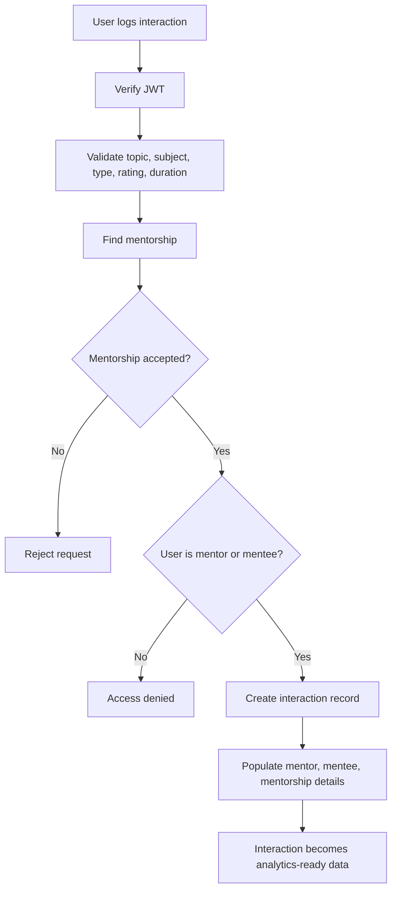
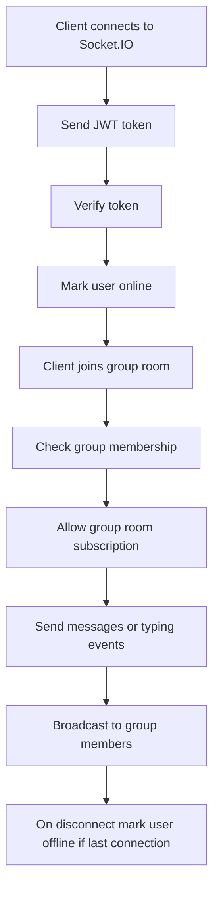
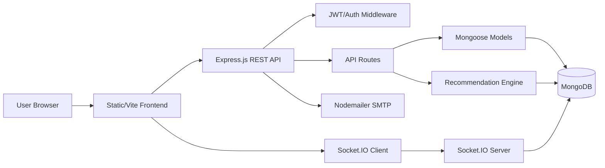

# MentorLink Project Report Information

## 1. Project Title

**MentorLink: A Data-Driven Interaction and Academic Analytics Platform**

## 2. Project Overview

MentorLink is a web-based, institute-focused mentorship and academic interaction platform. It connects juniors, seniors, faculty, and admins inside a verified institutional environment. The platform supports profile creation, mentor discovery, mentorship requests, real-time group chat, communities, posts, discussions, notifications, and analytics-ready interaction logging.

The main purpose of the system is not only communication, but also structured data collection. Every mentorship request, accepted relationship, discussion, message, and academic interaction can become useful data for recommendation, clustering, engagement analysis, and future academic decision-making.

## 3. Problem Statement

Students often need guidance for academics, projects, placements, technical skills, and career planning, but mentorship inside institutions is usually informal and scattered across messaging apps. This causes three issues:

1. Students cannot easily find suitable mentors based on skills, department, year, availability, or interests.
2. Mentorship activity is not recorded in a structured way, so institutions cannot analyze common academic problems or engagement trends.
3. Existing communication channels do not provide a verified, institute-only platform with secure access and role-based workflows.

MentorLink solves this by providing a centralized platform where students can discover mentors, request mentorship, communicate, participate in communities, and log structured interactions for analytics.

## 4. Objectives

- Build a verified institute-only platform using allowed email domains.
- Enable juniors to discover and request mentorship from seniors/faculty/admin users.
- Use machine learning inspired recommendation logic to rank suitable mentors.
- Provide real-time chat and notification support.
- Maintain structured interaction records for academic analytics.
- Support posts, communities, discussion forums, and user networking.
- Use secure authentication, authorization, input validation, and rate limiting.
- Store clean relational-style documents in MongoDB using Mongoose schemas and indexes.

## 5. Technology Stack

| Layer | Technology Used | Purpose |
|---|---|---|
| Backend | Node.js, Express.js | REST API and server-side application logic |
| Database | MongoDB, Mongoose | Document database and schema modeling |
| Authentication | JWT, bcryptjs | Token-based login and password hashing |
| Email | Nodemailer | OTP verification, login alerts, password reset, request alerts |
| Real-time | Socket.IO | Online status, group rooms, typing events, real-time notification delivery |
| Security | Helmet, CORS, express-rate-limit, express-validator | Headers, cross-origin access, rate limits, request validation |
| File Uploads | Multer | Profile, post, community, and group image uploads |
| Frontend | Static HTML/CSS/JS in `public`, plus Vite React app in `frontend` | User interface |
| ML/Analytics Logic | Custom JavaScript recommendation engine, Python helper scripts | Mentor ranking, clustering, dataset generation |

## 6. Main Features

### 6.1 Authentication and User Verification

- Register with institute email domain validation.
- Email OTP verification before account creation is completed.
- Profile completion step after email verification.
- Password hashing using bcrypt.
- Login using JWT token authentication.
- Forgot password and reset password flow using secure reset token.
- Login and profile update email notifications.
- Admin creation protected by admin-only route.

### 6.2 Profile Management

- User profile stores name, email, year, department, role, skills, interests, bio, CGPA, projects, profile picture, GitHub URL, availability, and mentorship intent.
- Profile completion percentage is calculated using important profile fields.
- Profile strength is calculated from profile picture, skills, bio, projects, and CGPA.
- Users can update profile details and follow/unfollow other users.

### 6.3 Mentor Discovery

- Users can fetch eligible mentors.
- Mentors are filtered by active status, mentorship intent, department, role, and academic year.
- Seniors must generally be from a higher year than the mentee.
- Faculty/admin users are treated as eligible mentors.

### 6.4 ML-Based Mentor Recommendations

- Personalized mentor recommendations are available at `/api/recommendations/mentors`.
- The system builds feature vectors for each mentor.
- K-Means clustering groups mentors based on profile and analytics signals.
- A compatibility score ranks mentors for a specific mentee.
- Existing pending or accepted mentors are excluded from recommendation results.
- The `/api/recommendations/mentors/:mentorId/explain` endpoint explains the score components for a selected mentor.

### 6.5 Mentorship Request Workflow

- A user sends a mentorship request with a reason.
- Duplicate pending or accepted mentorship requests are prevented.
- Recipient can accept or reject the request.
- Rejection requires a reason.
- Accepted mentorship automatically creates a private mentorship chat group.
- Requester and recipient receive email and in-app notification events.
- Mentorships can be terminated by participants.

### 6.6 Structured Interaction Logging

- Accepted mentorship participants can log interactions.
- Each interaction stores mentor, mentee, mentorship, topic, subject tag, interaction type, duration, satisfaction rating, notes, and timestamp.
- Only participants of an accepted mentorship can create logs.
- Interaction data supports analytics such as subject distribution, interaction type distribution, total duration, and average satisfaction.

### 6.7 Discussion and Doubt Forum

- Users can create subject-tagged academic discussions.
- Discussions support comments, voting, and resolved/unresolved status.
- Subject-wise discussion statistics can be generated.
- This helps identify high-demand subjects and frequently discussed academic topics.

### 6.8 Posts and Social Feed

- Users can create posts with text and media.
- Feed endpoint retrieves posts.
- Users can like, comment, view, and delete posts.
- Posts may be linked to communities.

### 6.9 Communities

- Users can create public/private/restricted communities.
- Communities include members, moderators, category, tags, rules, icon, banner, and settings.
- Users can join or leave communities.
- Community posts and moderation endpoints are supported.

### 6.10 Groups and Chat

- Users can create standalone chat groups.
- Groups have join codes, members, roles, pinned message, and avatar.
- Chat messages are stored in MongoDB.
- Socket.IO supports authenticated connection, group room joining, online/offline status, and typing indicators.

### 6.11 Notifications

- Notifications are created for mentorship requests, accepted requests, rejected requests, and new messages.
- Users can fetch notifications, mark one as read, or mark all as read.
- Real-time notification delivery is supported through Socket.IO rooms.

### 6.12 Security Features

- JWT authentication middleware protects private routes.
- Role-based access control supports junior, senior, faculty, and admin roles.
- bcrypt password hashing protects stored credentials.
- Helmet applies security headers.
- Rate limiting protects auth and API endpoints.
- Input validation is performed using express-validator.
- Mongoose schema validation enforces field types, lengths, enums, and indexes.
- File uploads restrict allowed image types and file size.

## 7. Methodology

The project follows a backend-first, data-driven methodology.

### Step 1: Requirement Identification

The system identifies the core institutional mentorship problem: students need reliable guidance and institutions need structured data about academic interactions.

### Step 2: User Role Design

The platform defines four main roles:

| Role | Responsibility |
|---|---|
| Junior | Seeks mentorship, asks doubts, joins communities |
| Senior | Offers mentorship, accepts/rejects requests, guides juniors |
| Faculty | Provides expert mentorship and academic guidance |
| Admin | Manages system-level privileges and administrative actions |

### Step 3: Data Modeling

MongoDB collections are designed around analytics-ready entities:

- `User`
- `Mentorship`
- `Interaction`
- `Discussion`
- `Comment`
- `Post`
- `Community`
- `Group`
- `ChatMessage`
- `Notification`

Indexes are added on high-use fields such as user IDs, status, timestamps, subject tags, interaction type, and group IDs.

### Step 4: Secure Access Layer

The system applies email verification, JWT authentication, role checks, rate limiting, input validation, and password hashing.

### Step 5: Recommendation and Matching Layer

Mentor recommendation combines:

- Profile feature extraction
- Skill/interests vocabulary encoding
- Mentor analytics extraction
- K-Means clustering
- Weighted compatibility scoring
- Ranking and explanation

### Step 6: Interaction Capture

All mentorship sessions can be logged in structured format. This creates clean transactional data that can later be used for dashboards, trend analysis, clustering, recommendation improvement, and academic reporting.

### Step 7: Real-Time Collaboration

Socket.IO adds live features such as:

- Authenticated socket connections
- User online/offline updates
- Group room joining
- Typing events
- Notification delivery

## 8. Algorithms Used

### 8.1 bcrypt Password Hashing

**Used for:** Secure password storage.

When a user sets a password, the system generates a salt and stores the bcrypt hash instead of plain text. During login, bcrypt compares the entered password with the stored hash.

### 8.2 JWT Token Authentication

**Used for:** Login session management and protected API access.

After successful login, a signed JWT is generated using the user ID. Private routes verify the token from the `Authorization: Bearer <token>` header.

### 8.3 OTP Generation

**Used for:** Email verification.

A six-digit OTP is generated using random number generation. The OTP is stored temporarily with a 15-minute expiry and sent by email.

### 8.4 Profile Strength Scoring

**Used for:** Measuring profile completeness/quality.

The system gives 20 points each for:

- Profile picture
- At least three skills
- Bio
- Projects
- CGPA

Maximum score is 100.

### 8.5 K-Means Clustering

**Used for:** Grouping mentors into clusters for recommendation.

The recommendation engine builds numerical feature vectors for mentors and applies K-Means clustering.

Features include:

- Skill and interest vector
- Year
- CGPA
- Profile strength
- Availability
- Department match
- Total interactions
- Average satisfaction
- Accepted mentorship count
- Completion rate
- Subject breadth
- Recency score

The number of clusters is selected using a heuristic:

```text
k = round(sqrt(number_of_mentors / 2))
```

The result is clamped between 2 and 6, depending on available mentor count.

### 8.6 K-Means++ Centroid Initialization

**Used for:** Better initial cluster center selection.

The first centroid is selected randomly. Next centroids are selected with probability proportional to squared distance from existing centroids. This improves clustering stability compared with purely random centroid selection.

### 8.7 Euclidean Distance

**Used for:** Distance calculation in K-Means and cluster fit.

Formula:

```text
distance(A, B) = sqrt(sum((Ai - Bi)^2))
```

### 8.8 Jaccard Similarity

**Used for:** Skill alignment between mentee needs and mentor capabilities.

Formula:

```text
Jaccard(A, B) = intersection(A, B) / union(A, B)
```

In MentorLink, set A contains mentee skills/interests and set B contains mentor skills/interests.

### 8.9 Weighted Compatibility Scoring

**Used for:** Ranking recommended mentors.

The final mentor score combines:

| Component | Weight |
|---|---:|
| Skill alignment | 0.28 |
| Same department | 0.10 |
| Academic progression | 0.10 |
| Availability match | 0.08 |
| Mentor quality | 0.18 |
| Activity signal | 0.11 |
| Profile strength | 0.10 |
| Cluster fit | 0.05 |

A primary cluster bonus of `0.08` is added when the mentor belongs to the cluster closest to the mentee profile.

### 8.10 Cosine-Style Similarity for Peer Matching

**Used for:** Peer recommendation module in `recommender_model/src/peerMatcher.js`.

The peer matcher measures token overlap between profile attributes:

```text
similarity = overlap / sqrt(size(left_set) * size(right_set))
```

It evaluates:

- Profile similarity
- Complementarity between target interests and candidate skills
- Reliability from past interactions
- Availability compatibility
- Year and department context
- Reciprocal activity penalty to reduce artificial mutual-boosting

### 8.11 MongoDB Aggregation

**Used for:** Analytics and recommendation statistics.

Aggregation pipelines calculate:

- Total interactions per mentor
- Average satisfaction
- Subject breadth
- Last interaction date
- Mentorship counts grouped by status
- Subject-wise interaction distribution
- Interaction type distribution

### 8.12 Fuzzy Matching and Keyword Scoring

**Used for:** Python clustering helper script `scripts/cluster_people.py`.

This script ranks entries by keyword matches in skills, interests, and projects. It uses token matching and `SequenceMatcher` fuzzy similarity for approximate matching.

## 9. Recommendation Pipeline



## 10. Authentication and Registration Flow



## 11. Login Flow



## 12. Mentorship Request Flow



## 13. Interaction Logging Pipeline



## 14. Real-Time Chat Pipeline



## 15. High-Level System Architecture



## 16. Database Design Summary

| Collection | Purpose |
|---|---|
| User | Stores account, profile, role, skills, interests, verification, followers, online status |
| Mentorship | Stores mentor-mentee request/relationship lifecycle |
| Interaction | Stores structured academic interaction logs |
| Discussion | Stores academic doubt/forum posts |
| Comment | Stores comments on discussions |
| Post | Stores social feed posts, likes, comments, and media |
| Community | Stores community metadata, members, moderators, rules, and settings |
| Group | Stores standalone or mentorship chat groups |
| ChatMessage | Stores group chat messages |
| Notification | Stores user notifications |

## 17. Analytics Possibilities

Current data structures support:

- Most discussed subjects
- Most active mentors
- Mentor satisfaction trends
- Interaction type distribution
- Student engagement over time
- Subject-wise doubt patterns
- Department-wise mentorship activity
- Recommendation quality analysis
- Profile completeness analysis
- Community and post engagement analysis

## 18. Current Implemented API Modules

| API Module | Base Route | Purpose |
|---|---|---|
| Authentication | `/api/auth` | Register, verify OTP, login, password reset, profile completion |
| Users | `/api/users` | Profile, mentors, juniors, search, suggestions, follow/unfollow |
| Mentorship | `/api/mentorship` | Request, accept, reject, active mentorships, terminate |
| Interactions | `/api/interactions` | Log and analyze structured interactions |
| Discussions | `/api/discussions` | Doubt/forum posts, comments, votes, resolve |
| Posts | `/api/posts` | Social feed, media, likes, comments |
| Communities | `/api/communities` | Community creation, membership, moderation |
| Groups | `/api/groups` | Group creation, join code, members, roles |
| Chat | `/api/chat` | Group chat messages |
| Notifications | `/api/notifications` | Read and manage notifications |
| Recommendations | `/api/recommendations` | ML-style mentor recommendations |

## 19. Conclusion

MentorLink is a secure, data-driven academic mentorship platform. It combines user verification, structured profiles, mentor recommendation, mentorship request management, real-time chat, community interaction, discussion forums, and analytics-ready data logging. The project uses K-Means clustering, similarity scoring, weighted ranking, MongoDB aggregation, JWT authentication, bcrypt hashing, OTP verification, and Socket.IO-based real-time communication.

The most important strength of the project is that it transforms informal student mentoring into structured, measurable, and analyzable academic interaction data.
