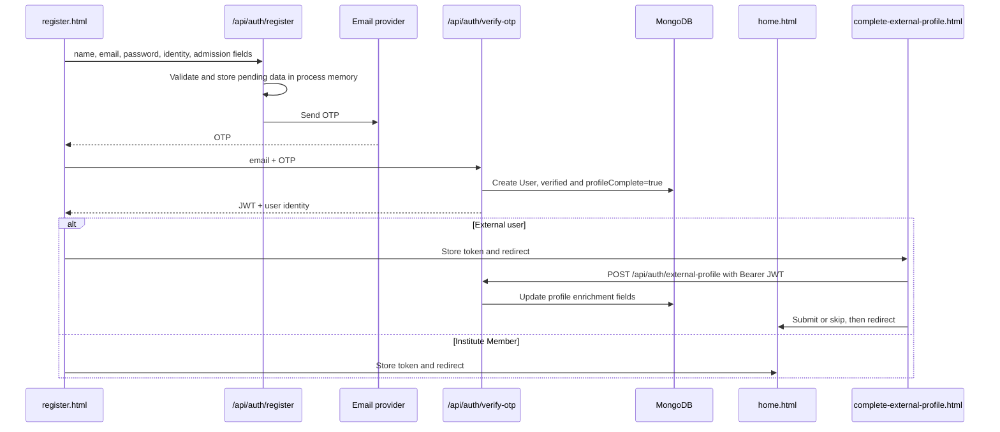

# System Architecture

Purpose: Explain the verified runtime structure, data flow, authentication paths, and boundaries between active and legacy code.

Last updated: 2026-09-23

## System View

```mermaid
flowchart LR
  Browser[Static public HTML/JS] -->|HTTP JSON + Bearer JWT| Express[Express server]
  Landing[React/Vite landing app] -->|links to public auth pages| Browser
  Express --> Middleware[Helmet/CORS/JSON/rate limits]
  Middleware --> Routes[Mounted API routes]
  Routes --> Mongo[(MongoDB via Mongoose)
User and feature models]
  Routes --> Email[Nodemailer SMTP]
  Browser <-->|Socket.IO JWT connection| Realtime[realtime/socket.js]
  Realtime --> Mongo
```

## Runtime and Route Mounting

`server.js` loads environment variables, creates Express and Socket.IO, connects MongoDB before listening, and serves `public/` as static files.

Global/request setup:

1. Security headers.
2. CORS.
3. JSON and URL-encoded body parsing.
4. `/api/` rate limiting.
5. Feature routers.
6. Upload static serving.
7. Static `public/` serving.
8. Error/not-found handlers.

Mounted routers:

| Mount | Route file | Purpose |
|---|---|---|
| `/api/auth` | `routes/auth.js` | Registration, OTP, External profile enrichment, login, legacy profile completion, reset, admin creation |
| `/api/users` | `routes/users.js` | Profiles, user search, recommendations, completion data |
| `/api/mentorship` | `routes/mentorship.js` | Mentorship requests and relationships |
| `/api/interactions` | `routes/interactions.js` | Interaction records and analytics |
| `/api/discussions` | `routes/discussions.js` | Discussions, comments, votes, resolution |
| `/api/posts` | `routes/posts.js` | Feed posts, comments, likes, uploads |
| `/api/communities` | `routes/communities.js` | Communities and membership |
| `/api/groups` | `routes/groups.js` | Groups and membership roles |
| `/api/chat` | `routes/chat.js` | Chat message REST endpoints |
| `/api/notifications` | `routes/notifications.js` | Notification state |
| `/api/recommendations` | `routes/recommendations.js` | Mentor recommendations |

## Technology Stack

Verified from `package.json` and imports:

- Node.js and Express 4.
- MongoDB via Mongoose 8 and the MongoDB driver.
- `bcryptjs` for password hashing.
- `jsonwebtoken` for JWTs.
- `express-validator` for reusable validation rules.
- `express-rate-limit` for rate limiting.
- Helmet and CORS.
- Multer for profile/content uploads.
- Nodemailer for email.
- Socket.IO for realtime events.
- Separate frontend package: React 19, Vite 7, Tailwind 4, ESLint.

The active application served by `server.js` is the static `public/` tree. The Vite/React application currently renders the landing experience and links to the static auth pages; it is not mounted by `server.js`.

## Directory Structure

```text
.
├── config/                 MongoDB connection implementations
├── middleware/             Auth, validation, security, error handling
├── models/                 Mongoose models
├── public/                 Served static application pages and uploads
│   └── js/                 Browser JavaScript helpers
├── realtime/               Socket.IO server behavior
├── recommender_model/      Peer matching implementation
├── routes/                 Express API routers
├── scripts/                Admin, setup, backup, and repair utilities
├── utils/                  Notifications, email, uploads, recommendations
├── frontend/               Separate Vite/React landing app
├── server.js               Express and Socket.IO entry point
└── package.json            Backend scripts and dependencies
```

## Active Registration Flow



The pending map is volatile and stores the password before hashing. The password is hashed by the `User` pre-save hook when the document is created.

## Active Login Flow

1. `public/login.html` submits email, password, and selected `userType`.
2. `/api/auth/login` loads the user with `+password`.
3. The selected account type is compared with stored `userType`; missing legacy values are treated as institute members for comparison.
4. `isActive`, `isVerified`, and `profileComplete` are checked.
5. `comparePassword()` verifies bcrypt.
6. A seven-day JWT containing the user ID is returned.
7. The browser stores `mentorlink_token` and redirects admins to `dashboard.html`, everyone else to `home.html`.

Protected API requests use `Authorization: Bearer <token>`. `middleware/auth.js` verifies the token, loads the user, and checks `isActive`.

## Legacy Boundaries

The following paths remain present but are not the primary registration flow:

- `public/profile-setup.html` and `/api/auth/complete-profile`.
- `public/verify-otp.html` and legacy resend behavior.
- `/api/auth/verify-email` token-based verification.
- `public/api-dashboard.html`, whose registration widget expects an older immediate-token response.
- `public/index.html`, which contains older embedded API/auth tooling in addition to the redirect to `landing.html`.

Do not merge or remove these paths without an explicit decision; see [rules.md](rules.md) and [memory.md](memory.md).

## Key Feature Flows

### Profile completion

External users now have a separate post-OTP enrichment page at `complete-external-profile.html`. It accepts an already-issued Bearer JWT and updates only profile picture, bio, mentorship intent, availability, interests, skills, project link, and GitHub URL through `POST /api/auth/external-profile`. The step can be skipped and always ends at `home.html`.

Institute Member users continue directly to `home.html` after OTP verification.

The legacy endpoint accepts password and optional profile fields, rejects users already marked complete, saves the user, and returns a JWT. The active flows bypass it; it remains reachable for legacy compatibility.

### Mentor matching

`routes/recommendations.js` filters active users by mentorship intent, excludes the current user, applies role/year eligibility, collects interaction and mentorship statistics, and delegates scoring to `utils/recommendationEngine.js`. A separate peer recommendation path uses `recommender_model/src/peerMatcher.js` through `routes/users.js`.

### Realtime

`realtime/socket.js` authenticates Socket.IO connections with JWTs and supports online state, rooms, typing, and call signaling. REST routes remain the source for persisted feature records.

## Source of Truth

For current behavior, prefer mounted routes, route handlers, models, and calls from `public/home.html` over older reports such as `IMPLEMENTATION_COMPLETE.md`. See [features.md](features.md) for endpoint-level walkthroughs.
